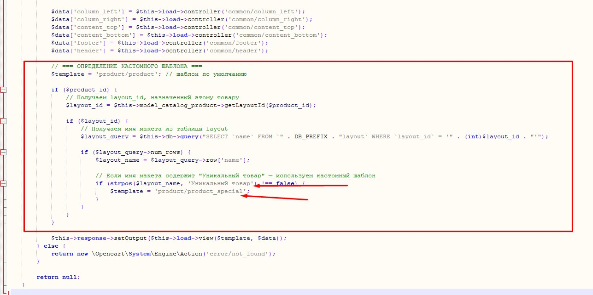
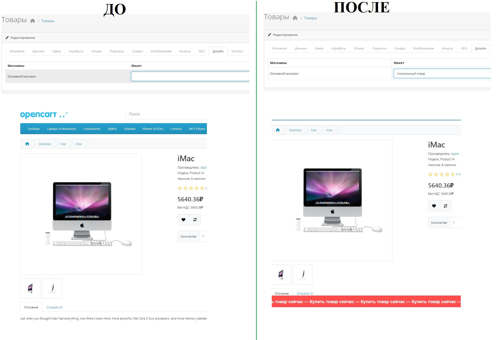
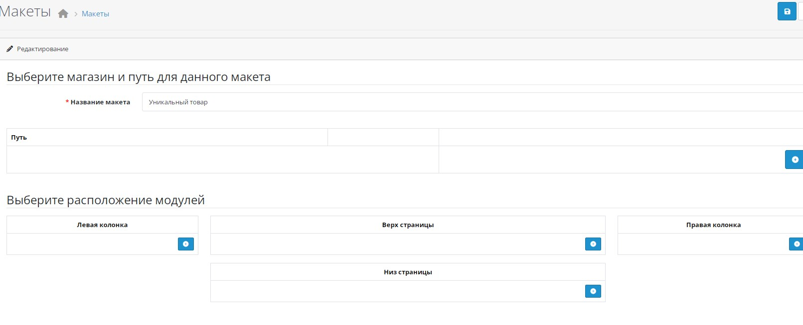

# 📌 Инструкция по созданию кастомного макета товара в OpenCart

## 🇷🇺 Русский

1. **Создайте новый макет** в админке OpenCart.  
   Например, назовите его **«Уникальный товар»** (название может быть любым — оно будет использоваться для определения шаблона).
   

3. **Создайте или скопируйте шаблон товара**:  
   Перейдите в папку:  catalog/view/template/product/
   Создайте новый файл `product_special.twig` **или** скопируйте `product.twig` и адаптируйте его под свои нужды (например, добавьте JavaScript-скрипт с бегущей строкой, измените структуру, классы и т.д.).

4. **Добавьте логику выбора шаблона в контроллер**:  
Откройте файл: catalog/controller/product/product.php
Найдите место, где определяется шаблон отображения (обычно перед `return $this->load->view(...)`), и вставьте следующий код:



```php
// === ОПРЕДЕЛЕНИЕ КАСТОМНОГО ШАБЛОНА ===
$template = 'product/product'; // шаблон по умолчанию

if ($product_id) {
    // Получаем layout_id, назначенный этому товару
    $layout_id = $this->model_catalog_product->getLayoutId($product_id);

    if ($layout_id) {
        // Получаем имя макета из таблицы layout
        $layout_query = $this->db->query("SELECT `name` FROM `" . DB_PREFIX . "layout` WHERE `layout_id` = '" . (int)$layout_id . "'");

        if ($layout_query->num_rows) {
            $layout_name = $layout_query->row['name'];

            // Если имя макета содержит "Уникальный товар" — используем кастомный шаблон
            if (strpos($layout_name, 'Уникальный товар') !== false) {
                $template = 'product/product_special';
            }
        }
    }
}
```
4. **Назначьте макет товару**:
В админке OpenCart откройте карточку нужного товара → вкладка «Дизайн» → выберите макет «Уникальный товар».
Теперь этот товар будет отображаться с использованием вашего кастомного шаблона product_special.twig.


# 📌 How to Create a Custom Product Layout in OpenCart

## 🇬🇧 English

1. **Create a new layout** in the OpenCart admin panel.  
   For example, name it **"Unique Product"** (you can use any name — it will be used to identify the custom template).
    

3. **Create or copy a product template**:  
   Go to the folder:  
   ``catalog/view/template/product/``  
   Create a new file called ``product_special.twig`` **or** copy the existing ``product.twig`` file and customize it as needed (e.g., add a JavaScript marquee script, modify HTML structure, CSS classes, etc.).

4. **Add template selection logic to the controller**:  
   Open the file:  
   ``catalog/controller/product/product.php``  
   Find the section where the view template is determined (usually just before the line ``return $this->load->view(...);``), and insert the following code:

   ```
   php
   // === CUSTOM TEMPLATE DETECTION ===
   $template = 'product/product'; // default template

   if ($product_id) {
       // Get the layout_id assigned to this product
       $layout_id = $this->model_catalog_product->getLayoutId($product_id);

       if ($layout_id) {
           // Fetch the layout name from the 'layout' table
           $layout_query = $this->db->query("SELECT `name` FROM `" . DB_PREFIX . "layout` WHERE `layout_id` = '" . (int)$layout_id . "'");

           if ($layout_query->num_rows) {
               $layout_name = $layout_query->row['name'];

               // If the layout name contains "Unique Product", use the custom template
               if (strpos($layout_name, 'Unique Product') !== false) {
                   $template = 'product/product_special';
               }
           }
       }
   }
```

4. Assign the layout to a product:
In the OpenCart admin panel, open the desired product’s edit page → go to the "Design" tab → select the "Unique Product" layout.
 
